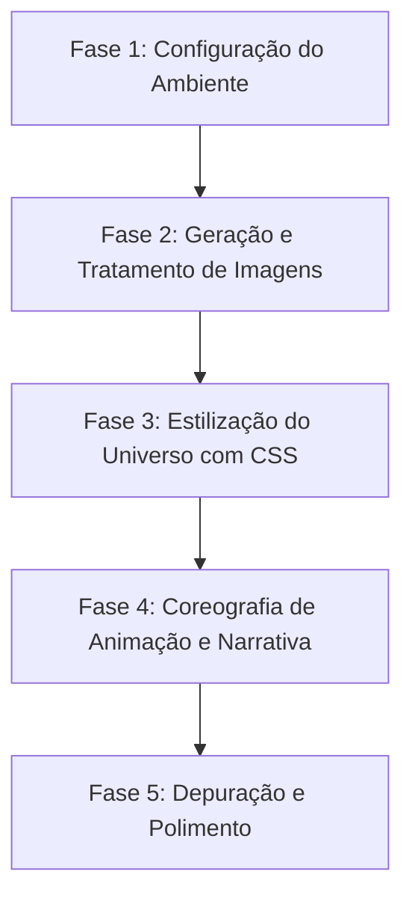

# Documentação do Projeto: Voyager 1 Scrollytelling 🌌🚀

Este documento descreve detalhadamente o passo a passo da implementação, arquitetura, design e as soluções técnicas adotadas para criar a experiência interativa de *scrollytelling* sobre a jornada cósmica da sonda Voyager 1.

---

## 🛠️ Tecnologias e Dependências Utilizadas

1. **Vite + React + TypeScript**: Base do projeto, garantindo builds extremamente rápidos e tipagem segura.
2. **@bsmnt/scrollytelling**: Biblioteca desenvolvida pela Basement Studio para construir narrativas baseadas em rolagem de página utilizando GSAP (GreenSock Animation Platform) de forma declarativa no React.
3. **Vanilla CSS**: Controle total e flexibilidade sobre os estilos, efeitos de vidro (*glassmorphism*), animações chaveadas (*keyframes*) e desenho de corpos celestes.
4. **Python (Pillow)**: Utilizado fora do ecossistema JavaScript para processar imagens com precisão de estúdio através de técnicas de chroma-key.

---

## 🗺️ Roteiro de Implementação: Passo a Passo

O projeto foi construído seguindo quatro fases principais:



---

### 📂 Fase 1: Configuração do Ambiente

1. **Inicialização do Projeto**: O app foi criado usando Vite com o template React + TypeScript.
2. **Instalação das Bibliotecas**:
   - `@bsmnt/scrollytelling` (que traz consigo suporte integrado a animações complexas controladas por scroll).

---

### 🖼️ Fase 2: Geração e Tratamento de Imagens (O Segredo da Transparência)

Um dos maiores desafios em design com IA é obter elementos isolados com canal de transparência (Alpha) limpo.

#### O Problema do "Fundo Xadrez" das IAs
Quando pedimos a uma IA geradora de imagens (como Midjourney ou Imagen) um "fundo transparente", ela costuma pintar fisicamente um quadriculado de pixels cinzas e brancos (o padrão que editores de imagem usam para representar transparência na tela). Isso ocorre porque ela foi treinada com capturas de tela e previews da web que continham esse padrão.

#### A Solução adotada: Chroma-Keying em Python
Para contornar isso e conseguir um recorte perfeito da sonda Voyager:
1. **Geração com Tela Verde**: Solicitamos que a IA gerasse a sonda Voyager 1 sobre um fundo verde-neon sólido puro (`chroma-key green`).
2. **Processamento Digital com Python**: Escrevemos um script Python (`scratch/process_image.py`) utilizando a biblioteca **Pillow** para:
   - Calcular o "esverdeamento" de cada pixel ($G - \max(R, B)$).
   - Tornar os pixels muito verdes 100% transparentes e manter o restante opaco.
   - Criar uma transição suave (anti-aliasing) nas bordas com base no nível de verde.
   - Aplicar **de-spill** (remoção do reflexo verde residual nas bordas metálicas da sonda para evitar halos).
3. O resultado foi salvo em `src/assets/voyager_probe.png` com transparência limpa e profissional.

---

### 🎨 Fase 3: Estilização do Universo (`src/index.css`)

Criamos uma atmosfera imersiva de espaço profundo sem sobrecarregar o navegador com arquivos pesados de imagem:

* **Fundo de Nebulosa**: Uma imagem estelar de alta resolução fixada no fundo com opacidade suave.
* **Corpos Celestes em CSS Puro**:
  - **Terra**: Gradiente radial azul/verde simulando a atmosfera terrestre.
  - **Júpiter**: Faixas dinâmicas de nuvens usando gradientes lineares sobrepostos e sombras profundas.
  - **Saturno**: Inclinação realista com anéis elípticos desenhados através de伪-elementos (`::before`/`::after`) e sombras projetadas.
  - **Disco de Ouro**: O famoso *Golden Record* desenhado com linhas circulares finas e um efeito de brilho metálico dourado.
* **Interface (UI)**: Cartões com efeito de vidro (*glassmorphism*) utilizando `backdrop-filter: blur(12px)` e bordas sutis brilhantes que aumentam de intensidade no hover.

---

### 🎬 Fase 4: Coreografia de Animação e Narrativa (`src/App.tsx`)

Sincronizamos a rolagem da página com as transformações físicas dos elementos na tela.

#### Ajuste Estrutural Crítico (Correção da Tela Preta)
Durante o desenvolvimento, a biblioteca `@bsmnt/scrollytelling` apresentou um erro no console devido ao Radix UI `<Slot>` que exige **apenas um único filho direto**.
* **Erro**: `React.Children.only expected to receive a single React element child`.
* **Solução**: Envolvemos toda a árvore interna do componente `<Root>` em uma única tag wrapper `<div className="scrolly-wrapper">`, permitindo que o estado e os gatilhos do GSAP fossem passados corretamente sem quebrar o ciclo de renderização do React.

#### Coreografia das Animações
Definimos um espaço de rolagem de `500vh` dentro do componente `<Pin>`. Conforme o usuário rola a página, o progresso (`progress` de 0 a 1) é traduzido em animações:

| Elemento | Animação no Scroll |
| :--- | :--- |
| **Sonda Voyager** | Começa grande, inclina e gira ao passar pelos planetas, acelera em Júpiter (estilingue gravitacional) e encolhe ao mergulhar no espaço profundo. |
| **Planeta Terra** | Desaparece rapidamente para cima conforme nos afastamos. |
| **Júpiter** | Entra pela lateral, cresce na tela revelando sua magnitude e sai rotacionando. |
| **Saturno** | Desliza com seus anéis brilhantes e rotaciona dramaticamente ao fundo da sonda. |
| **Golden Record** | Surge flutuando e rotacionando suavemente no encerramento da jornada interestelar. |
| **Cartões de Texto** | Entram e saem de cena deslizando de forma sequencial com base no progresso exato da rolagem. |

---

## 🚀 Como Executar e Testar

Se quiser rodar o projeto localmente para ver como as alterações se comportam:

1. **Instale as dependências** (se fizer um clone limpo):
   ```bash
   npm install
   ```
2. **Execute o servidor de desenvolvimento**:
   ```bash
   npm run dev
   ```
3. Abra a URL fornecida (geralmente [http://localhost:5173](http://localhost:5173)) no seu navegador.
4. **Gere a build de produção** para validar a otimização de assets:
   ```bash
   npm run build
   ```
   Os arquivos otimizados serão criados na pasta `dist/` prontos para deploy.

---

Este projeto demonstra como o desenvolvimento web moderno pode unir código limpo, design imersivo e técnicas externas de tratamento digital de imagem para criar uma experiência interativa fantástica! 🛸✨
